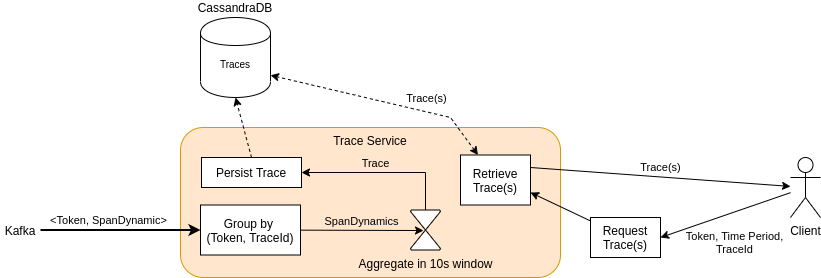

[](https://git.se.informatik.uni-kiel.de/ExplorViz/code/trace-service/-/commits/master) 

[](https://git.se.informatik.uni-kiel.de/ExplorViz/code/trace-service/-/commits/master)


# ExplorViz Trace-Service

Scalable service that processes, aggregates and persists the observed traces of method executions within monitored software applications.

## Features



The service serves three purposes

1. it aggregates dynamic information of monitored applications, i.e., method calls with timing information (`SpanDynamic`), and reconstructs traces based on these spans.
2. persists these traces in a Cassandra database.
3. assembles a list of traces upon client request (for a given landscape token and optionally time frame).

### Processing Dynamic Information

The Trace-Service reads `SpanDynamic` records from a Kafka topic.
Its main purpose is to identify and aggregate spans that belong to the same trace and store them. A `SpanDynamic` consists of

- `spanId` (uniquely identifies a span)
- `traceId` (identifies the trace the span belongs to)
- `parentSpanId` (identifies the parent of this span in the call hierarchy, i.e., the caller)
- timestamps of the start and end time
- the fingerprint (i.e. mapping to a structural record) and other metadata

You can find the full definition as an Avro schema [here](src/main/avro/spandynamic.avsc).

Each time the service ingests a span with an unknown `traceId`, it waits for 10s (in [stream time](https://kafka.apache.org/21/documentation/streams/core-concepts#streams_time)) for more spans of that trace to arrive. 
After 10s the window closes, all related spans are aggregated into a trace object, which is subsequently written to a Cassandra database.

Stored traces can be retrieved by clients. 
For that purpose, client have to specify the landscape token, and the time period for which traces should be retrieved. 

## Instructions

Before running this service, make sure the ExplorViz software stack is up and running, see [ExplorViz/deployment](https://git.se.informatik.uni-kiel.de/ExplorViz/code/deployment).

### Running the application in dev mode

You can run your application in dev mode that enables live coding using:
```
./gradlew quarkusDev
```

### Packaging and running the application

The application can be packaged using `./gradlew quarkusBuild`.
It produces the `trace-service-1.0-SNAPSHOT-runner.jar` file in the `build` directory.
Be aware that it’s not an _über-jar_ as the dependencies are copied into the `build/lib` directory.

The application is now runnable using `java -jar build/trace-service-1.0-SNAPSHOT-runner.jar`.

If you want to build an _über-jar_, just add the `--uber-jar` option to the command line:
```
./gradlew quarkusBuild --uber-jar
```

#### Docker
Follow the instructions in the comment section of the Dockerfiles to build Docker images.

### Creating a native executable

You can create a native executable using: `./gradlew build -Dquarkus.package.type=native`.

Or, if you don't have GraalVM installed, you can run the native executable build in a container using: `./gradlew build -Dquarkus.package.type=native -Dquarkus.native.container-build=true`.

You can then execute your native executable with: `./build/trace-service-1.0-SNAPSHOT-runner`

If you want to learn more about building native executables, please consult https://quarkus.io/guides/gradle-tooling#building-a-native-executable.
